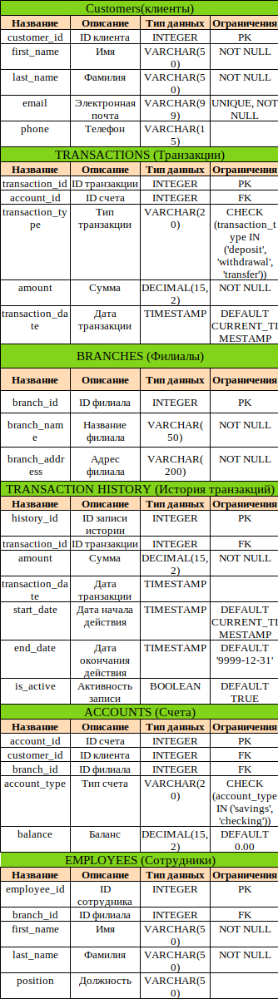
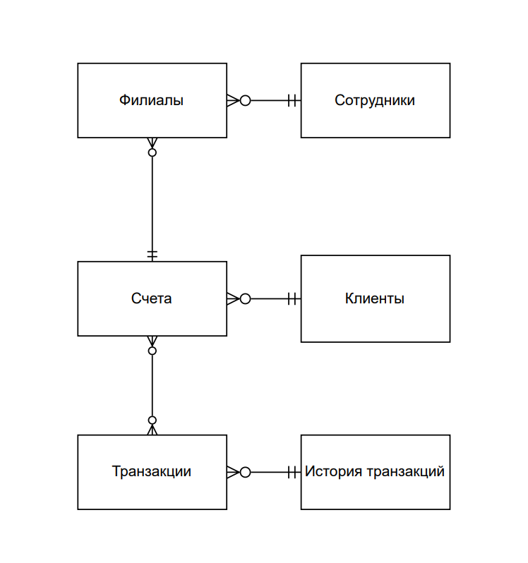
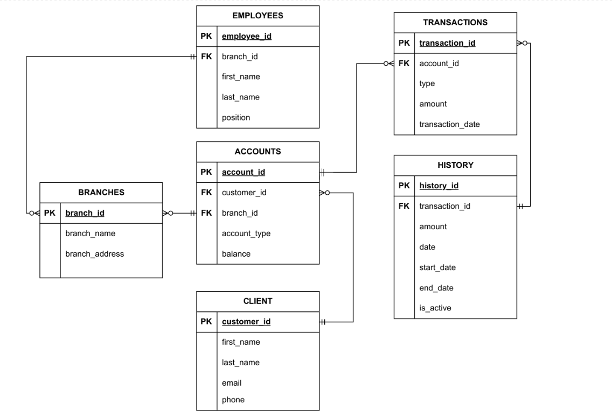

Проект: Банковская система. 
Описание: 
Реляционная база данных для управления клиентами, счетами, транзакциями, филиалами, сотрудниками и историей транзакций. 
Включает концептуальную, логическую и физическую модели, SQL-скрипты для создания таблиц, заполнения данными и аналитических запросов. 
Структура 
    /docs: Диаграммы моделей (concept.png, logical.png, physical.png) 
Таблицы из ./docs: 
 
 
 
В ./scripts/testing_scripts/* лежат примеры запросов к базе данных. В ./ddl и ./dml лежат sql скрипты для создания самих таблиц и заполнения их данными. 
Также в ./scripts лежат директории со скриптами для создания триггеров, функций, транзакций, представлений и процедур для БД. 
В ./analitics содержатся скрипты для проверки гипотез и генерации графиков, а также сами графики по данным из таблиц. 
Данные сегенерированны скриптом из ./data_creation через библиотеку faker.
